```mermaid
flowchart TD
User[👤 User Browser] --> FE[🌐 React Frontend]
FE --> NGINX[📦 Nginx Container]
NGINX --> BE[⚙️ Backend API]
NGINX --> DockerHub[(🐳 DockerHub Image Registry)]
```

# 🎨 CloudOps Frontend - React + Nginx + Docker

This repository contains the **React frontend** for the CloudOps portfolio.  
It connects to the backend API and is served via **Nginx** inside Docker.

---

## Features
- Displays backend health and items
- Dockerized for deployment
- CI/CD with GitHub Actions

---

## Tech Stack
- React.js
- Nginx
- Docker
- Axios
- GitHub Actions

---

## Project Structure

- src/ # React source code
- public/ # HTML template
- Dockerfile
- package.json
- .github/workflows/ci-cd-frontend.yml
- README.md


---

## Run Locally
```bash
npm install
npm start
```
Frontend will run on: http://localhost:3000

## Docker

```docker
docker build -t cloudops-frontend .
docker run -p 8080:80 cloudops-frontend
```

